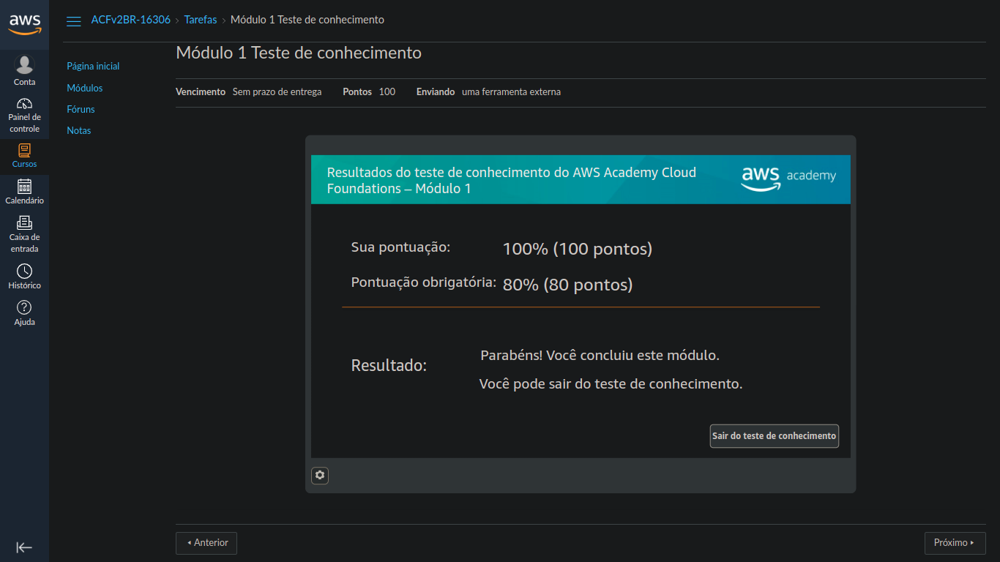

# Atividade 01

#

## Aluno: Alysson Alexandre de Oliveira Araújo
## Matrícula: 474084
## Disciplina de Computação em nuvem
## Professor: Emanuel Coutinho

# 

 
 

### Questão 01 - 0,5 Pontos

#### Resolva o Teste de Conhecimento do Módulo 1 - Visão geral dos conceitos de nuvem. Se você tirar 80 pontos no Teste de Conhecimento, receberá 0,8 * 0,5 = 0,4 pontos nesta questão.

 
 

### Questão 02 - 0,5 Pontos

1. **Quais são as seis principais vantagens da computação em nuvem?**

Resposta: As seguintes vantagens são:
* Vantagem 1 - Troque despesas de capital por despesas variáveis: Em vez das empresas investirem seus fundos financeiros em datacentes e servidores antes mesmo de saberem como eles serão usados, gastar com manutenção, entre outros gastos que são consideráveis, elas podem pagar apenas quando for consumido e usar os recursos que a computação em nuvem oferece. Isso traz a vantagem na economia do dinheiro a ser investido na área da tecnologia e a manutenção é reduzida, além da computação em nuvem facilitar em adaptações em novos aplicativos em poucos minutos.

* Vantagem 2 - grande economia de escala: Com o uso da computação em nuvem, o custo da da sua utilização é um custo variável que é inferior ao de ambientes locais, por exemplo o uso de datacenters localmente com suas manutenções. Isso é possível graças a centenas de milhares de clientes que utilizam a nuvem, onde provedores como a AWS conseguem obter economias de escala maiores, resultando em preços mais baixos com pagamento de acordo com o seu tempo de uso.

* Vantagem 3 - Pare de tentar adivinhar a capacidade: Com a computação em nuvem, não há necessidade de tentar calcular/imaginar a capacidade do servidor antes de implatar um aplicativo, por exemplo. É possível acessar a quantidade que quiser e, se for necessário futuramente, ajustar a escala conforme a necessidade rapidamente.

* Vantagem 4 - Aumente a velocidade e a agilidade: Em um ambiente de computação em nuvem, temos recursos adicionais de TI que estão com fácil alcance com apenas um clique, e isso significa que o tempo necessário para disponibilizar estes recursos aos desenvolvedores passa de semanas para poucos minutos. As consequências que isso causa vem a ser o aumento na velocidade na hora de organizar os recursos, já que o tempo e os custo que teriam se fosse necessário desenvolver os recursos do zero e fazer os respectivos testes, acabam sendo considerávelmentes menores usando computação em nuvem.

* Vantagem 5 - Pare de gastar dinheiro na execução e manutenção de datacenters: A computação em nuvem permite que a empresa possa se concentrar em seus clientes, e não no trabalho complicado de instalar racks, empilhar e alimentar os servidores, no caso na infraestrutura do servidor.

* Vantagem 6 - Tenha alcance global em minutos: implante aplicativos com facilidade em várias regiões da AWS no mundo com apenas alguns cliques. Como resultado,você pode oferecer latência menor e experiência melhor aos clientes com simplicidade e custo mínimo.

