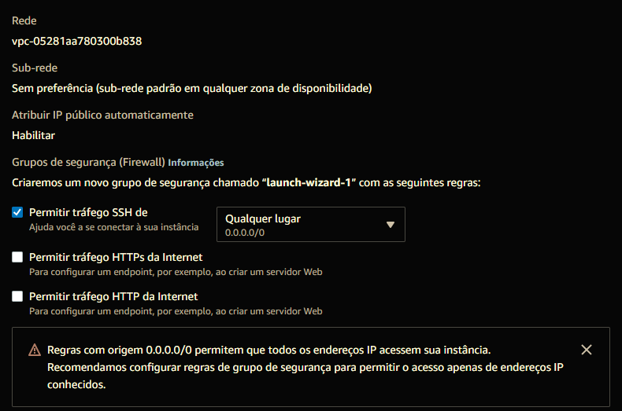
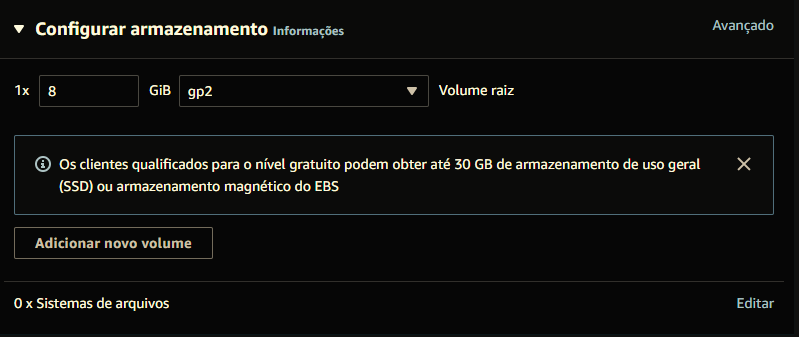

# Prática 05

## Criando Máquinas Virtuais

Data de criação: 17/04/2022

Autor: [Emanuel Coutinho](https://github.com/emanuelcoutinho)

Discente: [Alysson Alexandre de Oliveira Araújo](https://github.com/Alysson-Araujo)

## Objetivo
Explorar o EC2 e criar máquians virtuais.

## Instruções de Envio

Crie uma pasta no GITHUB chamada **Praticas de Laboratorio** e inclua um arquivo **PDF** ou usando a sintaxe da linguagem **MarkDown** de nome **Pratica05** com as questões a seguir e as respectivas respostas.

## Questões

Inicie o ambiente prático do **Sandbox**.

Uma vez pronto, acesse em **Details** >> **Show** e faça download da chave SSH (mantenha em segurança) em **Download PEM**.

Acesse o **EC2**.

## Questão 01 - Instância Linux

1. Vá até **Instâncias** e clique em **Executar Instâncias**.

2. Preencha os seguintes campos:

   - Nomes e tags - com o nome da sua máquina virtual
   - Escolha a imagem de aplicação e sistema operacional **Amazon Linux**
   - Par de chaves - selecione **vockey**

3. Identifique os seguintes campos e copie as informações:

   - Descrição da imagem a ser criada

        Amazon Linux 2 Kernel 5.10 AMI 2.0.20220406.1 x86_64 HVM gp2

        Arquitetura: 64 bits(x86)

        ID da AMI: ami-03ededff12e34e59e

    
   - Tipo da instância

        t2.micro: Da família t2, com **1 vCPU** e **1 GiB Memória**  
            
   - Configurações de redes
   
      

   - Armazenamento
         
      
         

   - Número de instâncias
      Possui apenas 1 instância

4. Identifique na lista de instâncias o endereço IP público da máquina virtual.
   O IP, do tipo IPv4, é _54.234.6.116_

5. Acesse a algum cliente SSH de sua preferência (eu uso ou o terminal com linha de comando ou o MobaXterm).

   - Insira o endereço IP
   - O usuário é **ec2-user**
   - Use a chave privada (chave SSH)
   - Acesse a máquina virtual
   - A partir da linha de comando ou terminal de outra máquina virtual ou máquina física, digite **ping** e o endereço IP da máquina virtual criada
   - Explique o que aconteceu
   - Na lista de instâncias, vá nos detalhes da máquina virtual, aba segurança, clique no grupo de segurança, vá nas regras de entrada, botão editar regras de entrada, adicione o seguinte: Tipo = ICMP - IPv4, Bloco CIDR = 0.0.0.0/0
   - Novamente digite o comando ping
   - Explique o que aconteceu

## Questão 02 - Instância Windows

1. Vá até **Instâncias** e clique em **Executar Instâncias**.

2. Preencha os seguintes campos:

   - Nomes e tags - com o nome da sua máquina virtual
   - Escolha a imagem de aplicação e sistema operacional **Windows**
   - Par de chaves - selecione **vockey**

3. Identifique os seguintes campos e copie as informações:

   - Descrição da imagem a ser criada
   - Tipo da instância
   - Configurações de redes
   - Armazenamento
   - Número de instâncias

4. Identifique na lista de instâncias o endereço IP público da máquina virtual.

5. Selecione a máquina virtual criada com a imagem windows
   - Clique em **Ações**, **Segurança**, **Obter senha do windows**
   - Associe à chave SSH e clique em **Descriptografar senha**
   - Salve os dados do IP privado, nome do usuário e senha

6. Na lista de instâncias, com esta instância selecionada, clique em **Conectar**
   - Você pode conectar sua instância windows usando uma área de trabalho remota cliente de sua preferência ou fazendo o download e executando o arquivo de atalho de RDP disponível
   - Opção com download: clique em **Fazer download de arquivo de área de trabalho remota**
   - Execute o arquivo
   - Utilize a senha obtida previamente e acesse a máquina virtual
   - Relate a prática

