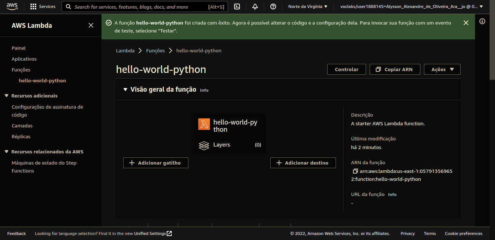
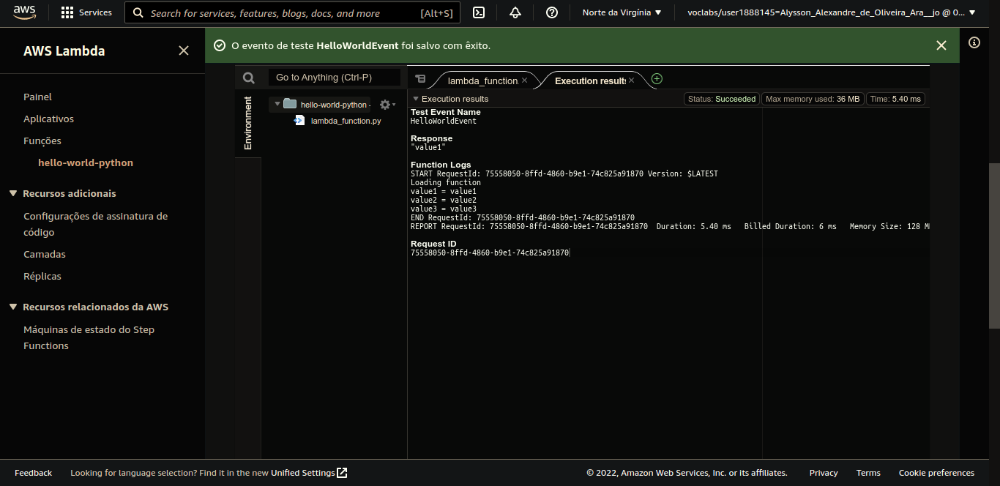

# Prática 07

## Amazon Lambda

Aluno: Alysson Araújo

## Objetivo
Explorar o Amazon lambda.

## Instruções de Envio

Crie uma pasta no GITHUB chamada **Praticas de Laboratorio** e inclua um arquivo **PDF** ou usando a sintaxe da linguagem **MarkDown** de nome **Pratica07** com as questões a seguir e as respectivas respostas.

## Atividades Iniciais

1. Inicie o ambiente prático do **Sandbox** ou acesse sua conta particular.

## Questão 1

1. Leia o site ["Arquitetura Serverless Computing - Computação sem Servidor"](https://blog.mandic.com.br/artigos/arquitetura-serverless-e-a-computacao-adaptativa/) e responda:

   - O que é arquitetura serverless?
   
        **Resposta:** A ideia da arquitetura serverless é desafiar o status quo do design de software e os fundamentos de implementação por alcançar um ótimo nível de desenvolvimento, operação e gerenciamento. Embora herde conceitos elementares da Microservices Architecture (MSA), é dotada de padrões arquitetônicos de ponta para atingir o nível mínimo possível de hardware ocioso.

    
   - Como funciona?

        **Resposta:** 

2. Leia o site ["Computação sem servidor – Amazon Web Services"](https://aws.amazon.com/pt/serverless/) e responda:

   - Quais serviços a plataforma sem servidor da Amazon fornece?
   - Quais os benefícios da plataforma sem servidor da Amazon fornece?
   - Quais os recursos a plataforma sem servidor da Amazon fornece?
   - Descreva um caso de uso do site

## Questão 2

A seguinte prática foi baseada no site [Execute um aplicativo "Hello, World!" sem servidor](https://aws.amazon.com/pt/getting-started/tutorials/run-serverless-code/).

Considere a execução da prática no ambiente do **sandbox** da AWS Aacdemy.

Execute o tutorial e relate o que ocorreu (problemas, soluções e resultados). Utilize imagens e textos.

- Acesse o **AWS Lambda**
- Selecione **Criar função**
- Selecione **Usar um esquema**

- Na caixa de filtro digite **hello-world-python**
- Selecione o esquema **hello-world-python**
- Clique em **Configurar**

- Em **Informações básicas**, em **Nome da função** utilize **hello-world-python**
- Em **Papel de execução** selecione **Usar uma função existe** e escolha **LabRole**
- Clique em **Criar função**

- Navegar pelas abas 

    

- Selecione **Testar** no menu
- Em **Nome do evento** digite **HelloWorldEvent**
- Clique em **Salvar**
- Clique em **Testar**
- Analise os resultados

    

- Execute várias vezes o teste, só para gerar dados para serem analisados

- Selecione **Monitor** no menu
- Analise as métricas e os gráficos

    

## Questão 3

- Clique em **Adicionar Gatilho**
- Na lista **Configuração do gatilho** selecione o evento **EventBridge**
- Para a regra, escolha **Criar uma regra**
- Para **Nome da regra** digite **cadaMinuto**
- Para **Tipo de regra** selecione **Expressão de programação**
- Para **Expressão de programação** digite **rate(1 minute)**
- Clique em **Adicionar**

- Selecione **Monitor** no menu
- Analise as métricas e os gráficos

- No menu **Ações** selecione **Excluir função**

